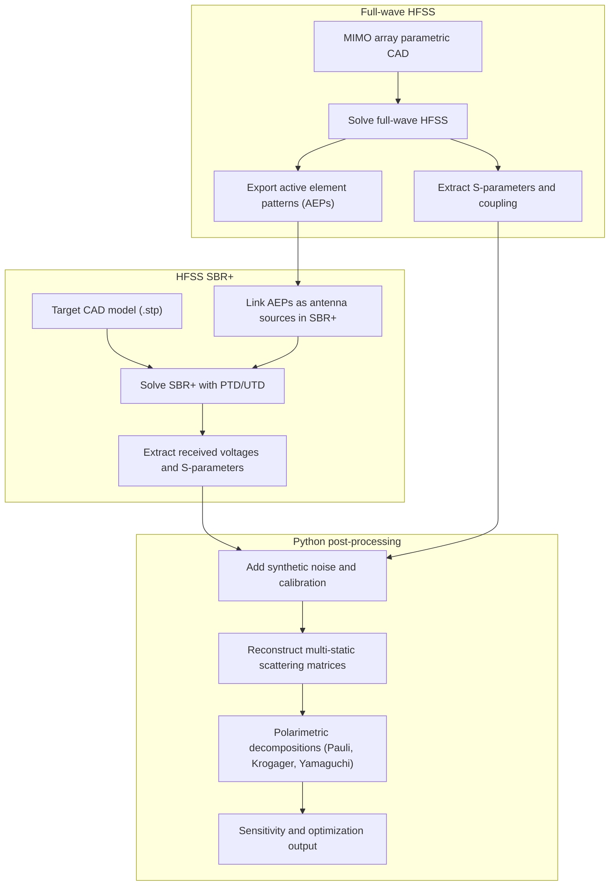

# Polarimetric MIMO Simulation Pipeline: Implementation Notes

This document details the architectural design, mathematical foundations, implementation details, and critical workarounds for the polarimetric MIMO radar simulation pipeline linking Ansys HFSS (full-wave), Ansys HFSS SBR+ (bistatic physical optics/diffraction), and Python post-processing.

---

## 1. Directory Structure and Package Layout

To integrate with the `pomaar` package structure, the modules are organized inside the `src/pomaar/` package directory:

```
/home/martin/Repositories/pomaar/
├── pyproject.toml
└── src/
    └── pomaar/
        ├── array_synthesizer.py      # Existing numerical layout synthesizer
        └── mimo_polarimetry/
            ├── __init__.py           # Subpackage initialization
            ├── implementation_notes.md # Merged design & technical notes
            ├── hfss_array_builder.py  # Module 1: HFSS Full-Wave Array Synthesis
            ├── sbr_simulator.py      # Module 2: SBR+ Target Solver
            └── polarimetry_processor.py # Module 3: DSP Post-Processing
```

All modules are PEP 8 compliant and importable as:
```python
from pomaar.mimo_polarimetry.hfss_array_builder import MimoHfssBuilder
from pomaar.mimo_polarimetry.sbr_simulator import SbrSimulationManager
from pomaar.mimo_polarimetry.polarimetry_processor import MimoPolarimetryProcessor
```

---

## 2. Technical Pipeline Architecture

The simulation pipeline operates in three distinct phases:



### Automation and API Controls
The pipeline uses **PyAEDT** (`ansys-aedt-core`) to automate spacing sweeps and loop closures:
1. The script updates array layout spacing dynamically in `mimo_polarimetry.aedt`.
2. It triggers the HFSS full-wave solver to compute Embedded Element Patterns (EEPs) and S-parameters.
3. SBR+ dynamically pulls the updated EEPs via the project link and solves target scattering.
4. SBR+ outputs are exported to JSON for post-processing.

---

## 3. Planar MIMO Array Layout Mathematics

The default configuration places both transmitter (Tx) and receiver (Rx) arrays on a single flat PCB substrate lying in the $z=0$ plane, enabling a unified full-wave layout.

```
       Tx Array (Sparse ULA)
  x--o--x--o--x--o--x--o--x--o--x  (y = subarray_spacing, z = 0)
  |                               |
  |<---       board_width     --->|
  |                               |
  o--o--o--o--o--o--o--o--o--o--o  (y = 0, z = 0)
       Rx Array (Dense ULA)
```

### Coordinates Formulation
* **Dense Rx Array:**
  Centred at the origin $(0,0,0)$ along the X-axis ($y=0$):
  $$x_{\text{rx}, j} = \left(j - \frac{N_{\text{rx}}-1}{2}\right) \cdot d_{\text{rx}}, \quad y_{\text{rx}, j} = 0, \quad z_{\text{rx}, j} = 0$$
  for $j \in [0, N_{\text{rx}} - 1]$. Default $d_{\text{rx}} = 0.5\lambda$ (half-wavelength).
* **Sparse Tx Array:**
  Centred at $(0, D_{\text{subarray}}, 0)$ along the X-axis:
  $$x_{\text{tx}, i} = \left(i - \frac{M_{\text{tx}}-1}{2}\right) \cdot d_{\text{tx}}, \quad y_{\text{tx}, i} = D_{\text{subarray}}, \quad z_{\text{tx}, i} = 0$$
  for $i \in [0, M_{\text{tx}} - 1]$. 
  * Default $d_{\text{tx}} = N_{\text{rx}} \cdot d_{\text{rx}}$ (creates a contiguous, non-overlapping virtual array).
  * Default $D_{\text{subarray}}$ is set to $10.0$ mm (79 GHz optimized).

---

## 4. Module Specifications & Implementation Workarounds

### Module 1: `hfss_array_builder.py` (`MimoHfssBuilder`)
* **Purpose:** Automates full-wave HFSS construction of the co-planar MIMO layout.
* **Key Implementation Details and Workarounds:**
  * **Headless Container Replication (X11 Clipboard Bypass):** PyAEDT's `.clone()` wraps HFSS's `Copy`/`Paste` operations, which hang indefinitely on headless X11/VNC servers due to clipboard selection locks. The script bypasses this by copying the template geometries exactly **once** using `copy_solid_bodies_from` and then performing local replication using `duplicate_along_line` with a temporary offset vector `[0, 0, 1.0]`, shifting the duplicate back to the origin, and applying rotation/translation.
  * **PhaseCentreCS Offset Integration:** Checks if a Relative Coordinate System named `PhaseCentreCS` is defined in the unit-cell design. If missing, it outputs a warning and prompts for user confirmation to proceed with a `[0,0,0]` offset. If present, it extracts the origin `[dx, dy, dz]`. During replication, the offset vector is rotated by the element's combined rotation (`total_rotation = element_yaw + rotation_yaw`) and subtracted from the target position (`pos - rotated_offset`), ensuring the physical phase centre of each antenna element lands exactly on the grid coordinate regardless of rotation (such as the $180^\circ$ rotated Tx elements).
  * **Dynamic Layer Sizing (Longitudinal Margin Removal):** To prevent feedlines from terminating inside the board, the script computes a hybrid bounding box. It extracts the $X$-bounds (width) from the unit-cell substrate object but computes the $Y$-bounds (longitudinal height) from the active copper trace and port sheet object bounds, ensuring the board edge terminates exactly where the feedlines end.
  * **Material Properties Fix:** Corrected the `create_box` parameter from `matname` to `material`, which resolved the issue where substrates and ground planes were being generated out of `"vacuum"` instead of their actual physical materials.
  * **Manual Deletion Cache Bug:** Deleting designs in the AEDT GUI leaves cached database references in memory. The script calls `save_project()` right before inserting the new target design to force AEDT to flush its design cache. It also wraps target design creation in a try-catch to fallback to connecting directly to the design if the database lock persists.
  * **Port Naming Double Underscore Fix:** Strips leading underscores from port name suffixes (e.g. `PortSheet_Rx_1_V` is parsed to `Port_Rx_1_V` instead of `Port__Rx_1_V`).
  * **Automatic Radiation Boundary (Airbox):** Computes overall PCB bounds in X, Y, and Z, calculates a $\lambda_0 / 4$ clearance (quarter-wavelength) rule of thumb at the operating frequency, creates a surrounding Airbox vacuum solid, and assigns a Radiation Boundary condition.
  * **Design Variable Synchronization:** To prevent dimension caching, the script loops through and copies all local design-level variables from the source unit-cell design to the target array design. This guarantees that any changes to unit-cell dimensions (e.g. patch size, stub length) propagate correctly even when reusing an existing target design, rather than being overridden by the target's stale variable values.
  * **Port Warning Suppression:** Automatically configures and enables `"Include Port Post Processing Effects"` via `edit_sources` after port generation, which suppresses HFSS warnings about port renormalization not impacting field results.

### Module 2: `sbr_simulator.py` (`SbrSimulationManager`)
* **Purpose:** Coordinates SBR+ ray-tracing simulations using the full-wave source.
* **Responsibilities:**
  * Manages the SBR+ design (clean, duplicate, configure).
  * Imports target geometries (calibration sphere and main target CAD).
  * Sets up setup variables, frequency sweeps, and SBR+ physics options (PTD/UTD, ray density).
  * Links the synthesized full-wave design (`MimoHfssBuilder.target_design`) as a composite linked antenna source.
  * Solves SBR+ for both targets.
  * Exports received voltages/fields per port to JSON.

### Module 3: `polarimetry_processor.py` (`MimoPolarimetryProcessor`)
* **Purpose:** Standalone off-line data processing and polarimetric DSP.
* **Responsibilities:**
  * Loads SBR+ JSON output and HFSS S-parameters.
  * Performs Polarization Distortion Matrix (PDM) calibration using canonical sphere backscatter results.
  * Applies mutual coupling compensation using the full-wave S-parameters.
  * Inject synthetic Gaussian noise matching a desired SNR (in dB).
  * Performs Pauli, Krogager, and Yamaguchi polarimetric decompositions.
  * Reconstructs and plots the polarimetric signatures.

---

## 5. Mathematical Foundations of MIMO Polarimetry

### Spatial Polarization Squint (Polarization Parallax)
In a spatial MIMO configuration, the horizontal and vertical polarization axes of each Tx-Rx pair are not aligned due to their different view angles toward the target.

Let the target be at $\mathbf{r}_{\text{tgt}} = [0, 0, R]^T$. Let the $m$-th Tx be at $\mathbf{r}_{\text{tx},m} = [x_{m}, y_{m}, 0]^T$ and the $n$-th Rx be at $\mathbf{r}_{\text{rx},n} = [x_{n}, y_{n}, 0]^T$.
The incident propagation vector $\hat{\mathbf{k}}_{i,m}$ and scattered propagation vector $\hat{\mathbf{k}}_{s,n}$ are:
$$
\hat{\mathbf{k}}_{i,m} = \frac{\mathbf{r}_{\text{tgt}} - \mathbf{r}_{\text{tx},m}}{\|\mathbf{r}_{\text{tgt}} - \mathbf{r}_{\text{tx},m}\|}, \quad \hat{\mathbf{k}}_{s,n} = \frac{\mathbf{r}_{\text{rx},n} - \mathbf{r}_{\text{tgt}}}{\|\mathbf{r}_{\text{rx},n} - \mathbf{r}_{\text{tgt}}\|}
$$

For a global polarimetric basis where Horizontal ($H$) is along $\hat{\mathbf{x}}$ and Vertical ($V$) is along $\hat{\mathbf{y}}$, the local spherical unit vectors ($\hat{\boldsymbol{\phi}}$ for $H$, $-\hat{\boldsymbol{\theta}}$ for $V$) at each antenna element must be projected onto the target’s coordinate system.
The local horizontal and vertical polarization vectors for the Tx-target link are:
$$
\hat{\mathbf{h}}_{i,m} = \frac{\hat{\mathbf{k}}_{i,m} \times \hat{\mathbf{z}}}{\|\hat{\mathbf{k}}_{i,m} \times \hat{\mathbf{z}}\|} \approx \hat{\mathbf{x}} - \frac{x_{m}}{R}\hat{\mathbf{z}}
$$
$$
\hat{\mathbf{v}}_{i,m} = \hat{\mathbf{h}}_{i,m} \times \hat{\mathbf{k}}_{i,m} \approx \hat{\mathbf{y}} - \frac{y_{m}}{R}\hat{\mathbf{z}}
$$

If the target has a local scattering matrix $\mathbf{S}_{\text{local}}$, the measured scattering matrix for the Tx-Rx pair $(m,n)$ is:
$$
\mathbf{S}_{mn} = \begin{bmatrix} S_{mn,HH} & S_{mn,HV} \\ S_{mn,VH} & S_{mn,VV} \end{bmatrix} = \mathbf{P}_{\text{rx},n}^T \mathbf{S}_{\text{local}} \mathbf{P}_{\text{tx},m}
$$
where $\mathbf{P}_{\text{tx},m}$ and $\mathbf{P}_{\text{rx},n}$ are the polarization projection matrices from the global coordinates to the local antenna axes. Because $\mathbf{P}_{\text{tx},m} \neq \mathbf{P}_{\text{rx},n}$ for $m \neq n$, a geometric cross-polarization component is induced. For a sphere ($\mathbf{S}_{\text{local}} \propto \mathbf{I}$), the measured off-diagonal terms $S_{mn,HV}$ and $S_{mn,VH}$ will be non-zero due to this **polarization squint/polarization parallax**.

---

## 6. Polarimetric Signature Extraction Methods

### 1. Coherent Decompositions

* **Pauli Decomposition:** Decomposes the scattering matrix $\mathbf{S}_{mn}$ into three mechanisms:
  $$
  \mathbf{S}_{mn} = \alpha \mathbf{S}_{\text{single}} + \beta \mathbf{S}_{\text{dihedral}} + \gamma \mathbf{S}_{\text{canted}}
  $$
  where:
  $$
  \mathbf{S}_{\text{single}} = \frac{1}{\sqrt{2}}\begin{bmatrix} 1 & 0 \\ 0 & 1 \end{bmatrix}, \quad \mathbf{S}_{\text{dihedral}} = \frac{1}{\sqrt{2}}\begin{bmatrix} 1 & 0 \\ 0 & -1 \end{bmatrix}, \quad \mathbf{S}_{\text{canted}} = \frac{1}{\sqrt{2}}\begin{bmatrix} 0 & 1 \\ 1 & 0 \end{bmatrix}
  $$
  $$\alpha = \frac{S_{HH} + S_{VV}}{\sqrt{2}}, \quad \beta = \frac{S_{HH} - S_{VV}}{\sqrt{2}}, \quad \gamma = \sqrt{2} S_{HV}$$
  *Note: Polarization squint couples $\alpha$ into $\gamma$, creating a false 'canted' scattering signature from a symmetric target.*

* **Krogager Decomposition:** Uses a circular polarization basis ($L, R$) to split $\mathbf{S}_{mn}$ into sphere ($k_s$), di-plane ($k_d$), and helix ($k_h$) components:
  $$S_{RL} = \mathrm i k_s e^{\mathrm i 2 \theta}, \quad S_{RR} = k_d e^{\mathrm i 2 (\varphi - \theta)}, \quad S_{LL} = k_d e^{-\mathrm i 2 (\varphi + \theta)}$$

### 2. Non-Coherent Decompositions

* **Cloude-Pottier Decomposition:** Performs eigenvalue decomposition on the average coherency matrix $\langle \mathbf{T} \rangle = \sum \lambda_i \mathbf{u}_i \mathbf{u}_i^H$, extracting:
  * **Entropy ($H$):** Degree of randomness ($H=0$ for pure targets, $H=1$ for isotropic noise).
  * **Anisotropy ($A$):** Relative importance of secondary scattering mechanisms.
  * **Mean Alpha Angle ($\alpha$):** Dominant scattering mechanism ($0^\circ$ for surface, $45^\circ$ for dipole, $90^\circ$ for double-bounce).
* **Yamaguchi Decomposition:** Decomposes the average covariance matrix $\langle \mathbf{C} \rangle$ into four mechanisms:
  $$\langle \mathbf{C} \rangle = f_s \mathbf{C}_{\text{surface}} + f_d \mathbf{C}_{\text{double}} + f_v \mathbf{C}_{\text{volume}} + f_c \mathbf{C}_{\text{helix}}$$

---

## 7. Critical Pitfalls and Mitigation Strategies

### Pitfall 1: Dynamic Mutual Coupling vs. Static Pattern Fallacy
* **The Problem:** Solving the full-wave MIMO array for every layout spacing is computationally expensive, tempting developers to use static patterns in SBR+. However, at tight spacings ($< 1\lambda$), mutual coupling dynamically alters the Embedded Element Patterns (EEPs).
* **Mitigation:** Define a threshold spacing (e.g., $1.5\lambda$). If spacing is larger, use pre-computed isolated patterns. If smaller, the script forces a full-wave solve of Project 1 to update EEPs before executing SBR+.

### Pitfall 2: Target Scattering Bistaticity
* **The Problem:** Complex targets have highly bistatic radar cross-sections (RCS). A fraction of a degree change in the bistatic angle between Tx and Rx can lead to $>10\,\mathrm{dB}$ scattering amplitude and phase fluctuations.
* **Mitigation:** Separate the **geometric polarization squint** (a coordinate artifact) from the **physical target bistatic variation** by comparing the MIMO simulation results against a baseline "monostatic virtual array" simulation where no spatial diversity exists (treating all virtual channels as monostatic).

### Pitfall 3: Polarimetric Calibration (PDM Extraction)
* **The Problem:** Spatial separation introduces path length differences and amplitude polarization imbalances.
* **Mitigation:** Implement a polarization distortion matrix (PDM) calibration framework:
  $$\mathbf{S}_{mn}^{\text{observed}} = \mathbf{R}_{n} \mathbf{S}_{mn}^{\text{true}} \mathbf{T}_{m} + \mathbf{N}_{mn}$$
  Solve for receiver distortion $\mathbf{R}_n$ and transmitter distortion $\mathbf{T}_m$ using a known calibration target (e.g., a metallic sphere and a dihedral reflector placed in the SBR+ scene) prior to testing the complex CAD target.

---

## 8. Unit-Cell Design Requirements & Constraints

> [!IMPORTANT]
> **Strict Unit-Cell Modeling Rules:**
> When designing a new unit-cell model in HFSS, you MUST follow these conventions for the simulation pipeline to function correctly:
>
> 1. **PCB Layer Naming Conventions:**
>    * All global layers (substrates and ground planes) must follow the format `L{Order}_{Type}`, for example:
>      * `L12_Substrate` (substrate between layer 1 and 2)
>      * `L2_Ground` (ground plane on layer 2)
>      * `L23_Substrate` (substrate between layer 2 and 3)
>    * Ground planes and substrates must end with `_Ground` and `_Substrate` respectively.
>
> 2. **Active Element & Port Sheet Naming:**
>    * Copper patch and feedline trace objects should be named clearly (e.g. `L1_Patch`, `L3_Trace`).
>    * Excitations sheets must be named `PortSheet` or `PortSheet{N}` (e.g., `PortSheet1`, `PortSheet2`).
>
> 3. **Boolean Dummy Solids:**
>    * Cutout slots or unites must be represented as vacuum solids and named following the format `f"{operation}_{target}"`, for example:
>      * `Subtract_L2_Ground` (a slot cutout to be subtracted from `L2_Ground`)
>    * These dummy elements are dynamically replicated, subtracted/united, and then consumed in the target design.
>
> 4. **PhaseCentreCS Creation:**
>    * To prevent array squint and phase alignment errors, you must manually run a single-element unit-cell simulation to find its radiation phase centre.
>    * Create a **Relative Coordinate System** named exactly `PhaseCentreCS` at the calculated phase centre origin.
>    * The script will automatically retrieve the origin coordinates of `PhaseCentreCS` and shift all element geometries during replication to ensure their phase centres align perfectly with the array grid.
>    * If `PhaseCentreCS` is missing, the script will prompt a warning and default to a `[0.0, 0.0, 0.0]` offset.
>
> 5. **Vacuum Objects Exclusion:**
>    * Standard vacuum containers like air boxes or custom objects like `RadiatingSurface` that are not part of the active antenna geometries or dummy cutouts must be named starting with known keywords (e.g. `RadiatingSurface`) so the script knows to ignore them.

